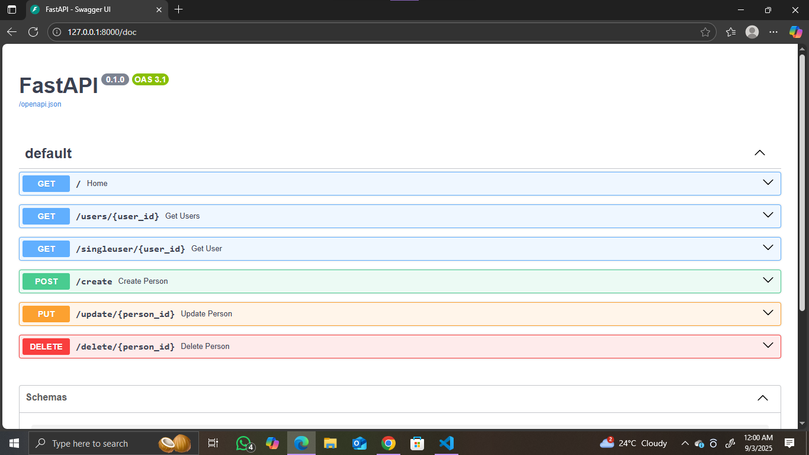
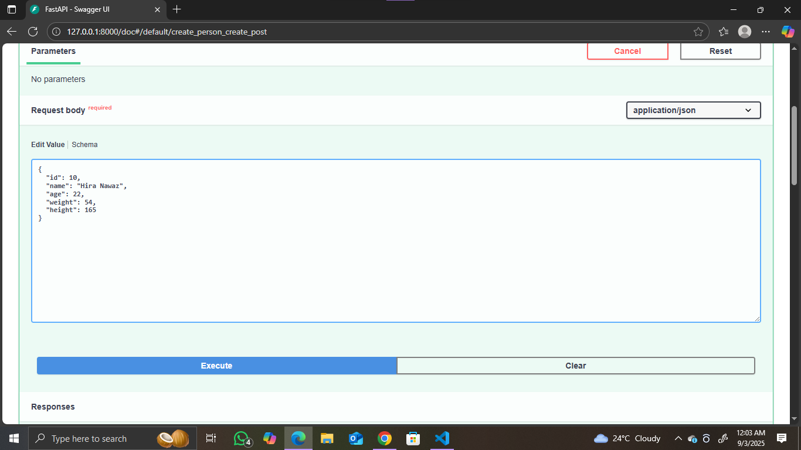
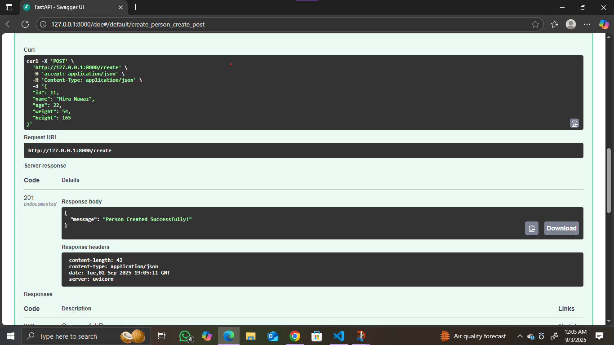
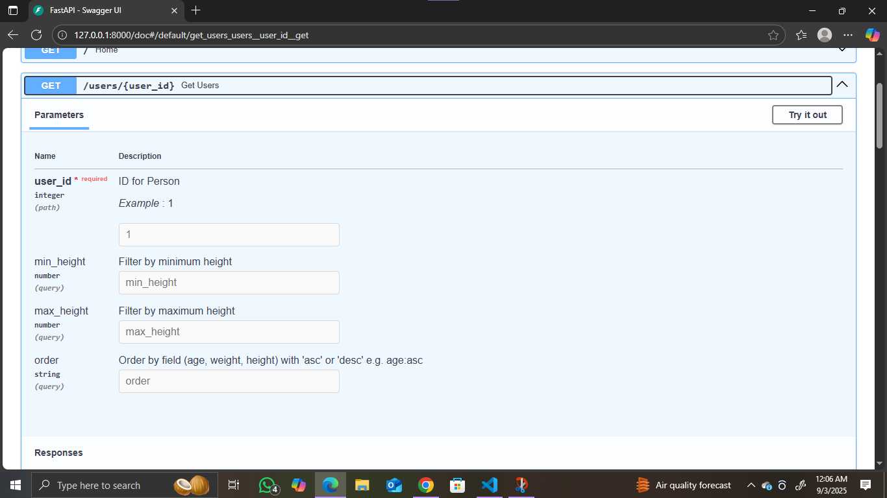
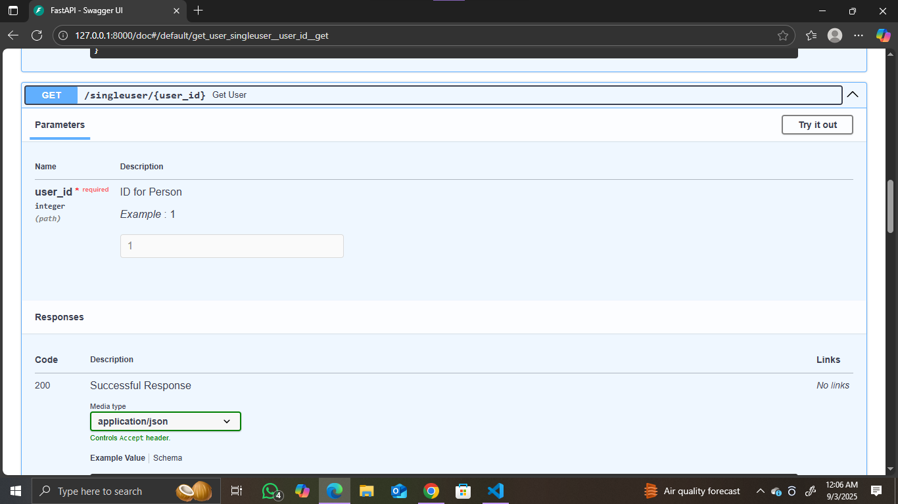

# FastAPI CRUD API
This project is a simple CRUD (Create, Read, Update, Delete) API built using FastAPI
. It provides RESTful endpoints to manage Person records with fields like id, name, and age.

## Features

. Create a new person

. Retrieve all persons or by ID

. Update person details

. Delete a person

. Built with FastAPI – super fast and automatic docs (Swagger UI & ReDoc)

## Screenshots

|  /home enpoint | API CRUD Methods |
|-----------|----------------|
|  | 
|-----------|----------------|
|  /home enpoint | API CRUD Methods |
|-----------|----------------|
|  | 
|-----------|----------------|
|  /home enpoint | API CRUD Methods |
|-----------|----------------|
|  | 

## API Endpoints

| Method | Endpoint           | Description        |
|--------|--------------------|--------------------|
| POST   | `/create`          | Create a new person |
| GET    | `/singleuser/{id}` | Get person by ID   |
| GET    | `/users`           | Get all persons    |
| PUT    | `/update/{id}`     | Update person by ID |
| DELETE | `/delete/{id}`     | Delete person by ID |

